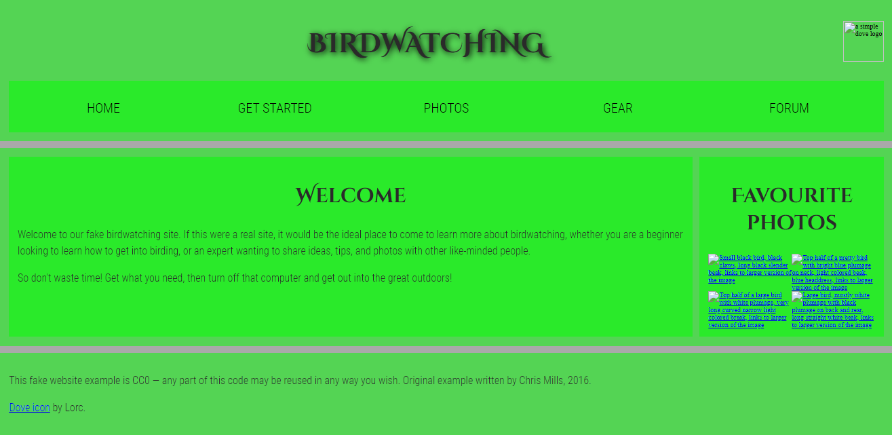

# Examen2Html

Este es la explicación del examen de HTML [este es el link de  los archivos](https://github.com/mdn/learning-area/blob/master/html/introduction-to-html/structuring-a-page-of-content-start/assets.zip?raw=true)

¿Que teniamos que hacer?
Bueno a nosotros no dan un codigo modificado y ese codigo lo teniamos que modificar y el resultado del codigo cambiado tenia que ser igual que el que nos pedian

Cosas que he tenido que hacer para hacer el examen

1 He añadido el nav para que se hagan referencias a las imagenes

<nav>
        <ul>
          <li>Home</li>
          <li><a href="#">Get started</a></li>
          <li><a href="#">Photos</a></li>
          <li><a href="#">Gear</a></li>
          <li><a href="#">Forum</a></li>
        </ul>
      </nav>
    
2 Posteriormente lo que he tenido que hacer es añadir el "main" e añadido el main para representar el contenido principal por asi decirlo el body

<main>
        <article>
          <h2>Welcome</h2>

          
Welcome to our fake birdwatching site. If this were a real site, it would be the ideal place to come to learn more about birdwatching, whether you are a beginner looking to learn how to get into birding, or an expert wanting to share ideas, tips, and photos with other like-minded people.

          
So don't waste time! Get what you need, then turn off that computer and get out into the great outdoors!

        </article>
        
3 Ahora he usuado el "aside" el aside sirve para mostrar el  contenido que está indirectamente relacionado con el contenido principal del documento ose va dentro del main porque el main es el contenido principal
 
 <aside>
        <h2>Favourite photos</h2>

        
        
        
        
      </aside>
    
4 Por ultimo he usado el "footer" que es el pie de pagina que es para el contenido de la sección

<footer>
        
This fake website example is CC0 — any part of this code may be reused in any way you wish. Original example written by Chris Mills, 2016.

        
<a href="http://game-icons.net/lorc/originals/dove.html">Dove icon</a> by Lorc.

      </footer>

